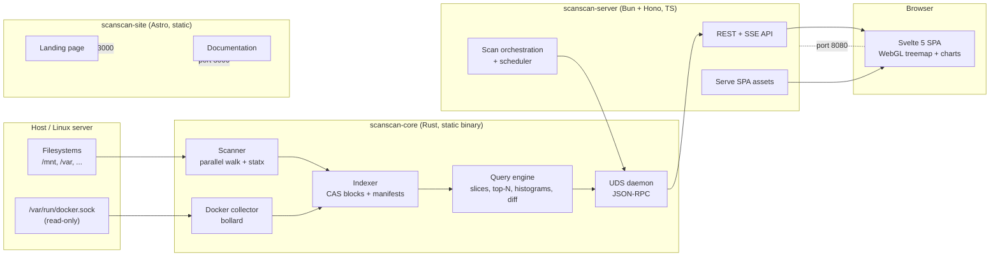

# scanscan — Master Development Plan

> A fast, headless, web-accessible disk-space analyzer and indexer — the WinDirStat experience
> for servers, without the weight of Diskover.

**Status:** Draft for approval
**Repo:** https://github.com/Roobyx/scanscan (`main`, currently contains only `LICENSE`)
**License:** GPL-3.0-or-later (already present in repo)
**Primary OS:** Linux → macOS → Windows

---

## 0. Decision summary (locked for this plan)

| Area | Decision | Rationale |
|---|---|---|
| Core engine | **Rust** (`scanscan-core` + `scanscan` CLI + daemon) | Peak scan throughput, bounded memory, safe parallelism, single static binary. Directly counters Diskover's Python/Elasticsearch cost. |
| API server | **TypeScript on Bun + Hono** | Thin orchestration layer; shared types with the web client; fast startup, low RAM; easy SSE/streaming. Go is a drop-in alternative behind the same IPC contract. |
| Web app | **Svelte 5 + Vite + TypeScript**, custom WebGL2 treemap | Smallest runtime, fine-grained reactivity for 1M-row tables, WebGL for millions of rectangles. (React + CSS Modules is the fallback if strict CSS-Module convention is required.) |
| Index storage | **Immutable content-addressed block store + snapshot manifests + mmap**; SQLite only for the tiny scan catalog | No Elasticsearch, no per-file document index, no 10–50M-row SQLite table. Bounded RAM, cheap incremental snapshots, free history/diff. |
| Aggregation | **Pre-order node layout + `subtree_size` column + contiguous subtree slices**, computed during scan | O(1) folder sizes, O(slice) top-N and histograms, no query database. |
| Docker | **Read-only Docker Engine API** (sizes, live stats, mounts overlay) | Meets requirement without write risk; mounts correlated back to index nodes. |
| Auth | **None in v1**, bind localhost/LAN; reverse-proxy/TLS documented | Read-only tool on trusted networks; auth deferred. |
| Freshness | **Manual + scheduled incremental rescans** | No continuous watchers in v1. |
| Platform depth | **Linux fast path**; portable generic walker on macOS/Windows | Ships v1 sooner; MFT/APFS fast paths are Phase 3+. |
| Marketing/docs | **Separate Astro + Starlight container on its own port** | Static, fast, docs-first; isolated from the app. |
| Delivery | **Phased: MVP first, then advanced** | Fastest path to a usable build. |

---

## 1. Vision & goals

`scanscan` answers one question fast and completely: **where did my disk space go?** — on a
headless Linux server, from any browser, with the visual immediacy of WinDirStat and the
operational lightness of `gdu`/`dua`.

Goals:

1. **Scan and index** entire filesystems (tens of millions of files, tens of TB) into a
   persistent, queryable index.
2. **Serve a web client** from a headless daemon with rich, interactive visualizations.
3. **Work fully from the command line** for scripting and agents.
4. **Understand Docker**: container/image/volume sizes, live stats, and — critically — map
   container mounts back onto the filesystem index so they are visible in every chart.
5. **Deploy trivially**: one image + compose, plus a Portainer-flavored stack.
6. **Be fast and light**: avoid Diskover's RAM/index cost; avoid `ncdu`-style single-level
   blindness and `du`-style waiting.
7. **Be agent-usable** via a first-class Skill.
8. **Be showcased**: a separate landing + documentation site on its own port/container.

### 1.1 Non-goals (explicit)

- Not a general file manager (no uploads/downloads/browsing of file contents).
- Not a backup/archival or deduplication *executor*.
- No destructive actions in v1 (no delete/move). Read-only by design.
- Not a real-time change watcher in v1 (scheduled/incremental rescans instead).
- Not a multi-tenant SaaS; no RBAC in v1.
- Not a byte-level image-layer analyzer (dive-like) in v1.

---

## 2. Requirements traceability

| # | Requirement | Where addressed |
|---|---|---|
| R1 | Crawl all files/folders and index them | §7 Scanner, §8 Index format |
| R2 | Headless server + web client | §6 Architecture, §9 Server, §10 Web client |
| R3 | Useful graphics/charts + more than WinDirStat | §10.3 Views, §21 Research matrix |
| R4 | CLI operation | §12 CLI |
| R5 | Optional Docker container stats, space usage, mounts recognizable in graphs | §11 Docker integration |
| R6 | Dockerfile + Docker setup + compose + Portainer flavor | §14 Deployment |
| R7 | Language chosen for performance, avoiding Diskover's cons | §0, §5 ADR-1/ADR-2, §19 Performance |
| R8 | Linux first, then macOS, then Windows | §7.6 Platform strategy, §23 Roadmap |
| R9 | Agent Skill | §13 Agent skill |
| R10 | Separate landing + docs webpage, own port + container | §15 Site |

---

## 3. Product principles

1. **Stream, don't hoard.** The scanner never holds the whole tree in RAM; it streams nodes
   to disk and keeps only O(depth) state plus a tiny hardlink set.
2. **Precompute at scan time.** Anything expensive (subtree sizes, extension tables, mount
   attribution) is computed once, while the data is hot.
3. **Immutable snapshots.** Every scan is an immutable manifest; incremental scans reuse
   unchanged blocks. History and diffs fall out for free.
4. **Aggregate before you ship.** The server never sends 50M nodes to the browser; it sends
   depth-limited, size-bounded tiles for the current viewport.
5. **Read-only and safe.** No destructive operation can happen through the UI or API in v1.
6. **Graceful degradation.** No Docker socket? Docker views disappear, everything else works.
   No WebGL? Canvas fallback. No fast path? Generic walker.

---

## 4. Glossary

- **Node** — a file, directory, symlink, or special entry in the index.
- **Snapshot / manifest** — an immutable, named index of one scan (or incremental update).
- **Block** — an immutable, zstd-compressed column chunk, addressed by content hash.
- **CAS** — content-addressed store: `blocks/<ab>/<hash>`.
- **Apparent size** — `st_size` (logical bytes).
- **Allocated size** — blocks actually consumed on disk (`st_blocks * 512`); what "space used" means.
- **Overlay** — non-filesystem metadata (Docker containers/mounts) joined onto nodes.

---

## 5. Architecture Decision Records (condensed)

### ADR-1 — Rust core, TypeScript server (hybrid)
- **Context:** Need maximum scan performance and bounded memory, but a fast-moving web/API layer.
- **Decision:** Rust owns scanning, indexing, querying, and Docker collection. A thin TS
  (Bun + Hono) server owns HTTP, orchestration, scheduling, and static serving. They talk over a
  versioned Unix-domain-socket JSON-RPC protocol (binary/MessagePack later for hot paths).
- **Consequences:** Clean process boundary; the core can run privileged while the server does
  not; server language is swappable (Go) without touching the core. Two runtimes to build/CI.

### ADR-2 — Content-addressed blocks + manifests, not a document DB
- **Context:** Diskover indexes every file as a document in Elasticsearch (4 GB+ RAM, large
  index, slow ingest). SQLite with 10–50M rows is workable but degrades on aggregation and
  rewrite. We need cheap incremental rescans and history.
- **Decision:** Store the index as immutable, zstd-compressed column blocks in a CAS, with a
  per-snapshot manifest. Nodes are laid out in pre-order so every subtree is a contiguous slice.
  Precompute `subtree_size`. mmap blocks for queries. A tiny SQLite catalog holds scan metadata.
- **Consequences:** Low RAM, fast reads, cheap incremental snapshots and diffs, no DB tuning.
  Requires a bespoke format and a GC/compaction job (accepted; this is the core differentiator).

### ADR-3 — Server-side aggregation + WebGL client
- **Context:** Millions of rectangles cannot be shipped as JSON per frame.
- **Decision:** The core computes squarified layouts and depth-limited aggregates; the server
  returns bounded tile sets. The client renders with WebGL2 and drills down on demand.
- **Consequences:** Constant payload sizes, 60fps pan/zoom. Layout algorithm must be correct
  and testable (property tests for area conservation).

### ADR-4 — Linux-first fast path, portable fallback
- **Decision:** Linux uses `statx` (mount id, allocated blocks, inode, nlink) and parallel
  `readdir`. macOS/Windows use the same portable walker (std metadata) behind a trait.
- **Consequences:** v1 is excellent on the primary target; MFT/APFS are later optimizations.

### ADR-5 — Read-only Docker integration
- **Decision:** Talk to the Docker Engine API via the socket mounted read-only; never mutate.
- **Consequences:** Safe by default; document `docker-socket-proxy` for least privilege.

### ADR-6 — No auth in v1
- **Decision:** Bind localhost by default, allow explicit LAN binding; document TLS/reverse proxy.
- **Consequences:** Fast delivery; must be clearly communicated; auth is Phase 3.

### ADR-7 — Separate static site
- **Decision:** Landing + docs are an Astro + Starlight static build in their own container/port.
- **Consequences:** Independent deploy cadence; no coupling to the app runtime.

---

## 6. System architecture

### 6.1 Component topology



### 6.2 Data flow (scan → index → query → render)

```mermaid
sequenceDiagram
  participant U as User/Agent
  participant S as Server (TS)
  participant C as Core (Rust daemon)
  participant D as Disk
  U->>S: POST /api/v1/scans {roots, options}
  S->>C: scans.create(...)
  C->>D: parallel walk + statx
  C-->>S: progress events (SSE relay)
  C->>C: write column blocks -> CAS
  C->>C: build manifest + precompute subtree_size
  C-->>S: snapshot ready
  U->>S: GET /treemap?path=/&depth=2
  S->>C: tree.tiles(snapshot, path, depth, color)
  C-->>S: bounded tile set (JSON)
  S-->>U: tiles
  U->>U: WebGL render; click to drill down
```

### 6.3 Runtime topology (Docker)

| Service | Image | Port | Purpose |
|---|---|---|---|
| `scanscan` | `scanscan/server` (bundles Rust core + SPA) | 8080 | API + web client |
| `scanscan-site` | `scanscan/site` (static, nginx/caddy) | 3000 | Landing + docs |

The core runs as a supervised child process of the server inside the same container by default.
An optional split topology runs `scanscan-core` as its own container with a shared socket volume
and `docker.sock` mounted only into it (least privilege).

---

## 7. The Rust core

### 7.1 Crates

```
crates/
  scanscan-core/     # library: scanner, index, query, docker, config
  scanscan-cli/      # `scanscan` binary (CLI + `daemon` subcommand)
  scanscan-ipc/      # protocol types (serde), shared with generated TS types
```

Key dependencies (justify each; avoid bloat):
`jwalk` or `ignore` (parallel walk + gitignore semantics), `rayon` (parallelism), `nix`/`libc`
(`statx`, `getdents`), `zstd` (block compression), `blake3` (block hashing), `memmap2` (mmap),
`serde`/`serde_json`, `bollard` (Docker Engine API), `tracing` (logs), `clap` (CLI),
`sqlx`/`rusqlite` (catalog), `globset` (exclusions).

### 7.2 Scanner

**Algorithm (streaming, pre-order):**

1. Resolve roots, canonicalize, read config/exclusions, detect filesystem boundaries.
2. Walk directories in parallel with a work queue. For each directory, `readdir` once; for each
   entry call `statx` with `STATX_BASIC_STATS | STATX_MNT_ID` and `AT_STATX_DONT_SYNC`.
3. Emit node records in **pre-order** (parent before child) to a spill writer. Maintain a stack
   of `(node_id, child_count)` to compute `subtree_size` on the way back up (O(depth) memory).
4. **Hardlink dedup:** only track entries with `st_nlink > 1` in a sharded `(dev, ino)` set; the
   first occurrence owns the bytes, later ones are flagged `hardlink_dup` (counted once for
   allocated total). Keeps the set tiny (most files have nlink == 1).
5. **Sparse files:** record both apparent (`stx_size`) and allocated (`stx_blocks * 512`).
6. **Mounts:** `stx_mount_id`/`st_dev` change marks a `mount_point` node; default
   `--one-file-system` skips descent, `--cross-filesystems` allows it.
7. **Symlinks:** not followed by default; `--follow-symlinks` with a visited `(dev, ino)` set for
   loop detection.
8. **Exclusions:** `.scanscanignore` (gitignore syntax) + glob/regex + built-in pseudo-fs
   excludes (`/proc`, `/sys`, `/dev`, `/run`, `/snap`). Explicit roots can override.
9. **Errors:** permission/I/O errors recorded as node flags + a scan error list; the scan
   continues.
10. **Progress:** emit throttled events (dirs, files, bytes, elapsed, ETA, current path).

**Incremental rescan:** if a directory's mtime and inode are unchanged from the prior snapshot
and it was fully scanned without errors, skip its subtree and **reuse the prior blocks** in the
new manifest. Re-stat only changed directories. This makes repeat scans of a mostly-static disk
near-instant and makes snapshots cheap (structural sharing).

**Memory budget:** O(depth) stack + hardlink set + fixed write buffers. Target < 512 MB RSS
scanning 50M files (see §19).

### 7.3 Index format (snapshot + CAS)

**Directory layout on disk:**

```
<data-dir>/
  catalog.db                # SQLite: scans, roots, schedules, config, block refcounts
  blocks/<ab>/<blake3>      # immutable zstd column blocks
  snapshots/<id>.manifest   # JSON/binary manifest (small)
  journal/                  # in-progress scan spill + WAL
  tmp/                      # staging, GC quarantine
```

**Node columns (structure-of-arrays):**

| Column | Type | Notes |
|---|---|---|
| `parent` | u32 | `0xFFFFFFFF` = root |
| `first_child` | u32 | linked children |
| `next_sibling` | u32 | |
| `name_off` | u32 | offset into NAMES blob |
| `ext_id` | u32 | index into extension table |
| `subtree_size` | u32 | number of nodes in subtree (pre-order ⇒ contiguous) |
| `size_app` | u64 | apparent bytes (subtree-summed at read time, or a second summed column) |
| `size_alloc` | u64 | allocated bytes |
| `mtime_ns` | i64 | |
| `uid`, `gid` | u32 | |
| `mode` | u16 | |
| `flags` | u8 | dir, symlink, hardlink_dup, sparse, mount_point, docker_mount, error |

Raw ≈ 60 B/node ⇒ 50M ≈ 3.0 GB; with SoA + delta/varint + zstd level 3, typically
**1.2–1.8 GB** plus a names blob (avg 30 B/name ⇒ ~1 GB raw, ~0.6–1 GB compressed).
**Total ≈ 2–3 GB for 50M files** — versus 10–30 GB+ for an ES-backed index.

**Blocking & compression:** columns are chunked into blocks of 64K nodes; each block is
independently zstd-compressed and hashed. Random access = decompress one block. A per-snapshot
manifest maps `(column, node_range) → block_hash`. Blocks are shared across snapshots via the CAS.

**Precomputed aggregates:** per-node `subtree_size` (u32). Subtree byte sums are computed by a
reverse prefix pass at load (O(n), ~50 ms for 50M in memory-mapped scan) or cached per snapshot.
Global histograms (extension, owner, age buckets) are computed once at scan time.

**Manifest contents:** format version, scan id/parent, roots + fs totals, exclusions, error
summary, timing/stats, block directory, extension table, histogram tables, Docker overlay section,
schema hash.

**Compaction/GC:** mark-and-sweep over live manifests; delete unreferenced blocks after a
retention policy (keep N snapshots or M days). Runs on a schedule or on demand.

### 7.4 Query engine

Operates on `(manifest, mmap)` and exposes:

- `stat(path|node)` — O(1) via manifest path index (a sorted path→node map block, optional).
- `children(node, sort, limit, offset)`.
- `subtree_slice(node)` — contiguous `[node, node + subtree_size)`.
- `top_n(scope, kind, metric)` — partial sort over a slice.
- `histogram(scope, dimension)` — extension/owner/age/size-bucket.
- `search(filters)` — parallel scan over columns (size, mtime, ext, owner, regex on path).
- `duplicates(mode)` — metadata duplicates (name+size, name+size+mtime) in v1; content hashes
  (BLAKE3, sampled/full) in Phase 3.
- `diff(a, b)` — join two manifests by path; report grown/shrunk/new/deleted.
- `tiles(scope, depth, width, height, color)` — squarified layout for the treemap, bounded count.
- `docker_view(snapshot)` — container/image/volume aggregates + mount→node mapping.

### 7.5 Daemon & IPC

- `scanscan daemon --socket /run/scanscan/scanscan.sock --data-dir ...`
- Protocol: **JSON-RPC 2.0**, newline-delimited over UDS, versioned (`"v": 1`).
- Methods: `scans.create|get|list|delete|cancel`, `scans.progress` (stream), `tree.children`,
  `tree.tiles`, `query.top`, `query.search`, `query.histogram`, `query.diff`, `docker.containers`,
  `docker.stats` (stream), `docker.mounts`, `export.run`, `config.get|set`.
- Progress and stats are server-push streams (JSON-RPC notifications).
- A generated TypeScript client/type set (`packages/api-types`) is produced from the protocol
  definitions to keep the server and core in sync (single source of truth in `scanscan-ipc`).

### 7.6 Platform strategy

| Platform | Fast path | Fallback |
|---|---|---|
| Linux | `statx` + parallel `readdir`, mount-id boundaries, sparse/allocated, hardlink dedup | — |
| macOS | Portable walker; clone detection (APFS) deferred to Phase 3 | `std::fs` metadata |
| Windows | Portable walker; NTFS MFT fast path deferred to Phase 3 | `std::fs` metadata, junction/reparse handling |

The scanner is a `trait Filesystem` with a `LinuxFs` implementation and a `PortableFs`
implementation, so platform work is isolated.

---

## 8. Index & storage design details

### 8.1 Why pre-order + CAS
Pre-order makes each subtree a contiguous range, so folder size is O(1) and "top-N in folder" is
a slice scan. CAS + manifests make incremental scans and history nearly free. Together they remove
the need for a general-purpose database on the hot path.

### 8.2 Capacity model

| Files | Raw nodes | Compressed index (est.) | Notes |
|---|---|---|---|
| 1M | 60 MB | 25–40 MB | trivial |
| 10M | 600 MB | 250–400 MB | comfortable |
| 50M | 3.0 GB | 1.2–2.0 GB | target ceiling for v1 |
| 100M+ | 6.0 GB | 2.5–4.0 GB | Phase 3 optimization (delta/varint tuning) |

### 8.3 Catalog (SQLite, tiny)
Tables: `scans`, `roots`, `schedules`, `settings`, `blocks` (refcount), `errors`, `docker_cache`.
Never stores per-file rows.

---

## 9. Server (TypeScript / Bun + Hono)

Responsibilities: HTTP API, SSE relays, scan orchestration, scheduling (cron), static serving,
config, and graceful supervision of the Rust daemon.

### 9.1 Endpoints (v1)

```
GET    /api/v1/health
GET    /api/v1/version
GET    /api/v1/config

GET    /api/v1/scans
POST   /api/v1/scans                 # {roots, options}
GET    /api/v1/scans/:id
DELETE /api/v1/scans/:id
POST   /api/v1/scans/:id/cancel
GET    /api/v1/scans/:id/progress    # SSE
GET    /api/v1/scans/:id/stats

GET    /api/v1/scans/:id/children/:nodeId?sort=size&limit&offset
GET    /api/v1/scans/:id/node/:nodeId
GET    /api/v1/scans/:id/tiles?path=&depth=&w=&h=&color=
GET    /api/v1/scans/:id/top?n=&kind=&metric=
GET    /api/v1/scans/:id/extensions
GET    /api/v1/scans/:id/owners
GET    /api/v1/scans/:id/age
GET    /api/v1/scans/:id/search?q=&size_min=&size_max=&mtime_before=&ext=&owner=&dupe=
GET    /api/v1/scans/:id/duplicates?mode=
GET    /api/v1/scans/:id/diff/:otherId
GET    /api/v1/scans/:id/export?format=csv|json|parquet

GET    /api/v1/docker/containers
GET    /api/v1/docker/containers/:id
GET    /api/v1/docker/stats          # SSE
GET    /api/v1/docker/mounts
GET    /api/v1/docker/df
```

### 9.2 Operational behavior
- Supervises the core process (start/restart/health), exposes readiness when the socket is up.
- Relays core progress/stats streams to browsers via SSE.
- Serves the built SPA (and falls back to `index.html` for client routes).
- Scheduling via cron expressions stored in the catalog; runs incremental scans.
- Structured logs (pino), Prometheus `/metrics`, request IDs.
- OpenAPI document generated from route schemas → feeds `packages/api-types`.

---

## 10. Web client

### 10.1 Stack
Svelte 5 + Vite + TypeScript; WebGL2 for the treemap; `d3-hierarchy` for sunburst/icicle layout;
`uPlot` for fast sparklines/time series; `ECharts` for bars/pies/histograms; TanStack-style
virtualized tables. Component-scoped styles (CSS Modules if the repo mandates it). Biome for
lint/format; `vp test`/`vp check` per repo conventions.

### 10.2 Performance strategy
- Never load more than a bounded tile set (e.g. ≤ 20k rectangles) per view.
- Server aggregates to the requested depth; deeper detail is fetched on drill-down.
- WebGL2 instanced rendering for rectangles; cushion shading in a fragment shader.
- Virtualized lists (only visible rows in the DOM).
- Debounced/abortable requests; progressive loading; cached tiles.

### 10.3 Views (WinDirStat and beyond)

**Core (WinDirStat parity):**
1. **Treemap** — squarified, cushion-shaded; area = size; nesting = hierarchy; color = dimension;
   click to drill down, breadcrumb to zoom out; hover tooltip; select ↔ table coupling.
2. **Directory tree / ranked list** — sortable by size, allocated, items, mtime; expand/collapse.
3. **Extension/type view** — aggregated by extension with color legend, coupled to the treemap.

**Additional (research-backed):**
4. **Sunburst / radial** — depth and hierarchy read at a glance (FolderSizes, DaisyDisk, Baobab).
5. **Icicle / flame graph** — hierarchy as stacked bars; excellent for deep paths (Brendan Gregg).
6. **Bubble / pack** — non-overlapping circles; good for a quick "biggest offenders" read.
7. **Top-N ranked bars** — largest files/folders, with a metric toggle (apparent/allocated/items).
8. **Age × size heatmap** — stale, large files are the best cleanup targets.
9. **Size-distribution histogram** — where the file-count mass sits.
10. **Owner/group breakdown** — who consumes the disk.
11. **Diff / trend view** — compare two snapshots: what grew, shrank, appeared, disappeared
    (gt5/FolderSizes parity; high operational value).
12. **Docker dashboard** — per-container size, image shared/unique, volume usage, live CPU/RAM/
    net/blkio sparklines, and a mount map.
13. **Filesystem summary** — total/used/free per mount, with scan coverage and errors.

**Color modes (shared across views):** extension | age | owner | container/mount | filesystem |
scan-diff (new/grown/shrunk). Mount/container overlays are drawn as labeled regions so bind
mounts and volumes are unmistakable in the treemap and sunburst.

### 10.4 Interaction model
WinDirStat's strength is *view coupling*: selecting a rectangle highlights the tree row, the
extension, and the details panel simultaneously. We reproduce this and add: URL-addressable state
(path, view, color, filters) so any view is shareable/linkable, and keyboard navigation.

### 10.5 Accessibility & responsiveness
Keyboard-operable drill-down, ARIA labels on charts, colorblind-safe palettes, light/dark themes,
usable on tablets; the table view is the accessible fallback for every chart.

---

## 11. Docker integration

### 11.1 Data collected (read-only)

| Source | Data |
|---|---|
| `GET /containers/json?size=1` | container list, `SizeRw`, `SizeRootFs`, image, state, labels |
| `GET /containers/{id}/json` | `Mounts[]` (Type, Source, Destination, RW), `GraphDriver.Data` (UpperDir/LowerDir/MergedDir) |
| `GET /containers/{id}/stats?stream=false` | CPU %, mem used/limit, net RX/TX, blkio read/write |
| `GET /system/df?verbose=1` | images (Size/SharedSize/UniqueSize), containers, volume `UsageData` |
| `GET /images/json` | image sizes, layers count, dangling detection |
| `GET /volumes` | named volume sizes and refcounts |

### 11.2 Mount → node mapping (the key feature)

For each container mount, resolve its host path and correlate with the index:

- **bind mount:** `Source` is a host path → find the node in the snapshot and flag
  `docker_mount`, recording `{container, containerId, destination, rw}`.
- **named volume:** resolve to `/var/lib/docker/volumes/<name>/_data` and flag the same way;
  if `/var/lib/docker` is indexed, the volume subtree is labeled with the volume name.
- **writable layer (overlay2):** `UpperDir` under `/var/lib/docker/overlay2/<id>/diff` is
  attributed to the container; its size is `SizeRw`. LowerDir/merged are shown as image content.
- **tmpfs:** reported as container-only usage (not on disk), shown distinctly.

Mounts become a first-class overlay dimension: in any chart, switch color to **container/mount**
to see which containers own which regions of the disk. Clicking a mount zooms to its host path;
clicking a container filters all views to its mounts. A dedicated panel lists every mount with
source, destination, RW, size, and the corresponding index node (with a "reveal in treemap" link).

### 11.3 Failure modes
- No socket / permission denied → Docker views disabled with a clear message; core unaffected.
- Rootless Docker / Docker Desktop / Podman → best-effort; document limitations.
- Socket exposure is powerful → recommend `tecnativa/docker-socket-proxy` (GET-only) and mounting
  `docker.sock` read-only only into the core container.

### 11.4 Optional Phase 3+
Image layer breakdown (dive-style), dangling-image detection, and **explicitly confirmed**
prune/remove actions behind a feature flag (write access deliberately deferred).

---

## 12. CLI

Single binary `scanscan`; JSON output on every command (`--json`) for scripting and agents.

```
scanscan scan <path...>            # scan + index; --incremental, --one-file-system,
                                   # --follow-symlinks, --exclude <glob>, --ignore-file
                                   # --apparent, --threads N, --progress
scanscan daemon                    # run the UDS daemon
scanscan ls [path]                 # list children (sortable, --json)
scanscan du [path]                 # subtree sizes; --depth, --apparent
scanscan top [path] -n 50          # largest files/dirs
scanscan find [path]               # filters: --size, --mtime, --ext, --owner, --regex, --dupe
scanscan tree [path]               # print hierarchy
scanscan ext [path]                # extension breakdown
scanscan diff <snapA> <snapB>      # growth/shrink
scanscan docker                    # containers, sizes, mounts (--json)
scanscan export <snap> --format csv|json|parquet
scanscan snapshots                 # list/delete/GC
scanscan config get|set
scanscan completions <shell>
```

Optional TUI (`scanscan tui`, ratatui) is a Phase 2 nice-to-have for parity with `gdu`/`dua`.

---

## 13. Agent skill

A first-class Skill so agents can drive scanscan safely and effectively.

```
skills/scanscan/
  SKILL.md          # frontmatter: name, description, when-to-use
  reference.md      # full CLI + API reference, JSON schemas
  examples.md       # task recipes (find space hogs, docker disk audit, diff a week)
  scripts/
    space_report.sh # scan + top-N + extension breakdown, human summary
    docker_audit.sh # container/volume sizes + mounts
    find_stale.sh   # large + old files
```

`SKILL.md` outline:
- **When to use:** disk-full investigations, "what's using space", Docker disk audits, cleanup
  triage, capacity questions.
- **Prereqs:** `scanscan` on PATH or the HTTP API base URL.
- **Core workflow:** `scanscan scan <path> --json` → `scanscan top` / `find` / `du` → interpret →
  report. Prefer `--json`; never delete anything.
- **Safety:** read-only; confirm before any destructive external action; respect exclusions.
- **Reference:** command list, filters, API endpoints, snapshot/diff semantics.

The skill is documented on the docs site and installable into agent skill directories.

---

## 14. Deployment

### 14.1 Images

- **`scanscan/server`** — multi-stage: (1) build the Rust core (musl static), (2) build the Svelte
  SPA, (3) `oven/bun` runtime image with the core binary + server + static assets. Non-root
  runtime user where possible; the core may need `CAP_DAC_READ_SEARCH` (or root) to read all files.
- **`scanscan/site`** — Astro static build served by `nginx:alpine` (or `caddy`).

### 14.2 Compose (abridged)

```yaml
services:
  scanscan:
    image: scanscan/server:latest
    ports: ["8080:8080"]
    volumes:
      - scanscan-data:/data                       # index + catalog
      - /mnt:/host/mnt:ro                          # host filesystems (read-only)
      - /var/run/docker.sock:/var/run/docker.sock:ro
    environment:
      SCANSCAN_DATA_DIR: /data
      SCANSCAN_BIND: 0.0.0.0:8080
      SCANSCAN_ROOTS: /host/mnt
      SCANSCAN_DOCKER: "true"
    restart: unless-stopped

  scanscan-site:
    image: scanscan/site:latest
    ports: ["3000:80"]
    restart: unless-stopped

volumes:
  scanscan-data:
```

### 14.3 Portainer stack
`deploy/compose/portainer-stack.yml` with Portainer-friendly features: `x-` anchors, `.env`
placeholders (`${SCANSCAN_PORT}`, `${HOST_MOUNT}`), healthchecks, and a README describing the
deploy flow (Stacks → Add stack → paste/upload → set env → deploy). Include a `docker-socket-proxy`
service variant for least privilege.

### 14.4 Security & operations
- Read-only mounts; no destructive API; no telemetry.
- Bind localhost by default; document reverse proxy + TLS for LAN exposure.
- Healthchecks on both services; structured logs; `/metrics`.
- Document rootless, SELinux/AppArmor, and read-permission caveats.
- Data volume backup = copy `blocks/`, `snapshots/`, `catalog.db`.

---

## 15. Marketing & documentation site

Separate container, separate port (3000), static.

**Stack:** Astro + Starlight (docs) + a custom landing page; MDX content; search built in.

**Landing page:** hero + one-line pitch; animated treemap/sunburst demo (recorded or live static
asset); feature grid; "how it compares" table vs WinDirStat/WizTree/Diskover/Filebrowser;
screenshots; quickstart (compose one-liner); Docker/Portainer section; agent-skill section; CTA
to docs/GitHub.

**Docs pages:**
- Getting started, Installation (Docker, compose, Portainer, binary), Quickstart
- Web UI guide (every view, color modes, drill-down, coupling)
- Visualizations explained (treemap vs sunburst vs icicle vs bubble; when to use which)
- Docker integration (sizes, stats, mounts, overlay semantics, socket proxy)
- CLI reference (every command/flag, JSON schemas)
- HTTP API reference (generated from OpenAPI)
- Agent skill usage
- Index & snapshot format (for contributors), architecture overview
- Configuration & environment variables
- Scheduling & incremental scans
- Performance & capacity planning
- Security, privacy, and permissions
- Troubleshooting & FAQ
- Contributing, license, changelog

---

## 16. Repository layout (monorepo)

```
scanscan/
  PLAN.md                      # this document
  README.md
  LICENSE                      # GPL-3.0-or-later
  AGENTS.md                    # build/test conventions for agents
  Cargo.toml                   # Rust workspace
  crates/
    scanscan-core/
    scanscan-cli/
    scanscan-ipc/
  apps/
    server/                    # Bun + Hono
    web/                       # Svelte 5 SPA
    site/                      # Astro + Starlight
  packages/
    api-types/                 # generated TS types + client
    ui/                        # optional shared components
  skills/
    scanscan/SKILL.md
  deploy/
    docker/
      Dockerfile.server
      Dockerfile.site
    compose/
      docker-compose.yml
      portainer-stack.yml
      .env.example
  docs/                        # repo docs (ADRs, feature matrix)
  .github/workflows/           # CI matrix
```

Tooling per `AGENTS.md`: Biome for lint/format, `vp test` / `vp check`, CSS Modules (or scoped
styles) co-located, explicit `.js` extensions on relative TS imports, no `baseUrl`, version +
changelog bumps on every meaningful change.

---

## 17. Testing & QA

**Rust:** unit tests for scanner edge cases (hardlinks, sparse, symlinks/loops, mount boundaries,
permissions, deep paths, unicode names); property tests for squarified layout (area conservation,
no overlap); golden tests for the block/manifest format; fuzz the manifest parser; criterion
benchmarks on synthetic trees (1M/10M/50M).

**TypeScript:** `vp test` for server routes and IPC client; contract tests against a fixture
core; API schema snapshot tests.

**Integration/E2E:** Playwright flows (scan a fixture fs → browse treemap → drill down → search →
diff → docker panel); compose smoke test; Portainer stack validation.

**CI:** GitHub Actions matrix (Linux, macOS, Windows) for build/test/lint; Docker image build +
compose smoke on Linux; release workflow producing multi-arch images.

**Fixtures:** a generator producing deterministic trees of known size/shape (including hardlinks,
sparse files, many extensions, deep nesting).

---

## 18. Observability

- Rust: `tracing` structured logs (JSON), scan metrics (files/s, bytes/s, errors), `/metrics`.
- Server: pino logs with request IDs, Prometheus metrics, health/readiness endpoints.
- UI: optional diagnostics panel (scan stats, index size, cache hit rate).

---

## 19. Performance budgets & benchmarks

| Metric | Target |
|---|---|
| Scan throughput | ≥ 500k files/min warm SSD; 50M files < ~10 min |
| Core RSS while scanning | < 512 MB at 50M files |
| Snapshot index size | ≤ 2 GB at 50M files |
| Tile query P95 | < 150 ms (depth-2 aggregate) |
| Node/children query P95 | < 20 ms |
| Search over 50M | < 2 s (column scan, parallel) |
| Web first paint | < 2 s; 60 fps pan/zoom on 1M tiles (WebGL) |
| Whole stack RAM | < 1 GB (vs 4 GB+ for Diskover) |
| Cold start | < 1 s (core), < 300 ms (server) |

Benchmark harness runs in CI on synthetic trees and is published with releases.

---

## 20. Security & privacy

- Read-only everywhere; no destructive endpoints in v1.
- Docker socket read-only + recommended GET-only proxy.
- No telemetry, no external calls; fully offline-capable.
- Bind localhost by default; LAN exposure documented with TLS/reverse-proxy guidance.
- Path validation against indexed roots to prevent traversal in the API.
- No secrets stored; config in env/volume.
- Clear documentation that the scanner needs broad read access (root or
  `CAP_DAC_READ_SEARCH`) and that the Docker socket is privileged.

---

## 21. Prior-art research matrix

| Tool | Platform | Scan | Persistent index | Views | Docker | Web | CLI/TUI | License | Takeaway |
|---|---|---|---|---|---|---|---|---|---|
| WinDirStat | Windows | multithreaded, NTFS | no | treemap, tree, ext, dupes, report | no | no | no | GPL-2 | The UX to emulate: coupled views, treemap + ext list + tree. |
| WizTree | Win/macOS | MFT (very fast) | no | treemap, tree, file search, dupes, CSV | no | no | CLI export | proprietary | MFT speed; CSV/treemap export; allocated vs apparent. |
| TreeSize | Windows | fast | no | tree, treemap, sunburst, reports, scheduler | no | no | CLI | proprietary | Sunburst + scheduler + reports. |
| SpaceSniffer | Windows | live | no | treemap (zoomable) | no | no | no | freeware | Zoomable treemap interaction. |
| QDirStat | Linux (Qt) | fast | no | treemap, tree, ext, cleanup tools | no | no | CLI tools | GPL | Treemap + integrated cleanup tools; package-manager view. |
| Baobab | Linux (GNOME) | medium | no | treemap, rings, tree | no | no | no | GPL | Multi-view of one dataset. |
| Filelight | Linux (KDE) | medium | no | radial/sunburst | no | no | no | GPL | Radial clarity. |
| GrandPerspective | macOS | medium | no | treemap | no | no | no | GPL | Configurable treemap filters. |
| DaisyDisk | macOS | fast | no | sunburst | no | no | no | proprietary | Sunburst polish; cloud/stale awareness. |
| FolderSizes | Windows | fast | snapshots | treemap, sunburst, bars, reports, scheduler, snapshots | no | no | CLI | proprietary | Snapshots + trend + scheduler + many reports. |
| gdu | Linux/mac/win | very fast (Go) | no | TUI, JSON export | no | via ttyd | CLI/TUI | MIT | Speed + ncdu JSON interop. |
| ncdu | POSIX | fast | optional export | TUI | no | via ttyd | CLI/TUI | MIT | Simplicity; JSON import/export. |
| dua-cli | Linux/mac/win | very fast (Rust) | no | TUI | no | no | CLI/TUI | MIT | Parallel Rust scanning; hardlink handling. |
| dust | cross | fast (Rust) | no | tree bars | no | no | CLI | Apache | Instant `du`-style ranking. |
| duc | Linux | indexed DB | yes (own DB) | TUI/X11 | no | no | CLI | GPL | Persistent index + history — but no web. |
| gt5 | Linux | fast | no | TUI + HTML | no | HTML | CLI | GPL | Diff/trend between scans. |
| diskonaut | Linux | fast (Rust) | no | TUI treemap | no | no | TUI | MIT | Terminal treemap. |
| duvis | cross | Rust | no | browser treemap, sunburst, list | no | local browser | CLI | MIT | Closest prior art; validates Rust + browser treemap. |
| Diskover | Linux | Python crawl → Elasticsearch | yes (ES) | web treemap, filters, search | no | yes | CLI crawler | Apache-2 | The web treemap benchmark — and the cautionary tale on RAM/index weight. |
| Filebrowser | cross | none (live) | no | web list | no | yes | no | Apache-2 | Lightweight web access; no visualization. |

**Borrow:** coupled views (WinDirStat), MFT-class speed idea (WizTree), sunburst/scheduler/reports
(TreeSize/FolderSizes), persistent index + history (duc/gt5), Rust parallel scanning (dua),
browser treemap (duvis), web delivery (Diskover).

**Avoid:** Elasticsearch-weight indexing, Python crawl throughput, no-persistence live-only tools,
single-level TUI blindness, and destructive defaults.

---

## 22. Roadmap & milestones

### Phase 0 — Foundation (1 sprint)
Scaffold Rust workspace + TS monorepo; define IPC types; CI (build/lint/test matrix); Biome,
`vp test`/`vp check`, Cargo fmt/clippy; AGENTS.md; Dockerfile skeletons.
**Exit:** `cargo test` + `vp test` + `vp check` green; empty server/SPA/site boot in containers.

### Phase 1 — MVP (3–4 sprints)
Linux scanner (`statx`, parallel, hardlink dedup, sparse, mount boundaries, exclusions, errors);
CAS block store + manifest + `subtree_size`; CLI `scan|ls|du|top|find` with `--json`; UDS daemon;
server REST/SSE for scans/children/tiles/top; Svelte treemap (cushion, drill-down) + ranked table;
Docker sizes + mounts overlay; Dockerfile + compose + Portainer stack; basic agent skill.
**Exit:** scan a real multi-TB disk, browse a WebGL treemap in the browser, run CLI queries, deploy
via compose, and get useful Docker mount overlays.

### Phase 2 — Views & operations (3–4 sprints)
Sunburst, icicle, bubble, ranked bars, extension view, age heatmap, size histogram, owner
breakdown; search/filter UI; export (CSV/JSON); incremental rescans + scheduler; Docker dashboard
(live stats sparklines); virtualized tables; URL-addressable state; TUI (optional).
**Exit:** full analytical surface; incremental rescan of a static disk < 5% of full-scan time.

### Phase 3 — Depth & scale (3–4 sprints)
Duplicate detection (metadata → optional content hashes); diff/trend view; owner/stale analysis;
50M-file performance tuning; GC/compaction; macOS/Windows portable build + release artifacts;
optional MFT/APFS fast paths; optional auth (single token / RBAC); image-layer analysis (flagged).
**Exit:** 50M files within budget; cross-platform binaries; history/diff production-ready.

### Phase 4 — Site & release (2 sprints)
Landing + full docs site; screenshots/demos; API docs generated; multi-arch images; release
workflow; changelog; versioned releases; agent skill published + documented.
**Exit:** public landing + docs live on port 3000; v1.0.0 released.

---

## 23. Risks & mitigations

| Risk | Impact | Mitigation |
|---|---|---|
| Bespoke index format bugs | Data loss / wrong sizes | Golden + fuzz tests; format versioning; validate against `du` on fixtures |
| CAS GC correctness | Disk growth / missing blocks | Refcount catalog + mark-and-sweep tests; quarantine before delete |
| WebGL large-data rendering | Jank / crashes | Depth-limited tiles, bounded counts, canvas fallback |
| Docker socket portability | Missing Docker data | Graceful disable + clear messaging; document rootless/Podman limits |
| Two runtimes (Rust + TS) | CI/build complexity | Single multi-stage Dockerfile; shared generated types; matrix CI |
| Permission errors on host | Incomplete scans | Record + report errors; document capabilities/root |
| Windows/macOS correctness | Wrong sizes (sparse/clones/MFT) | Portable walker tests; fast paths deferred and validated separately |
| Scope creep | Slipped v1 | Phased roadmap with explicit exit criteria; non-goals enforced |
| GPL-3.0 implications | Distribution constraints | Intentional (matches WinDirStat lineage); document for integrators |

---

## 24. Acceptance criteria (per requirement)

- **R1** — A scan of a ≥1 TB filesystem produces a persistent snapshot; repeated `du`-style queries
  match `du` within tolerance on fixtures; 50M-file synthetic scan completes within budget.
- **R2** — `docker compose up` exposes a working web client on 8080 from a headless host with no
  desktop environment.
- **R3** — Treemap, sunburst, icicle, bubble, ranked bars, extension, age, owner, histogram, diff,
  and Docker views all render from the same snapshot.
- **R4** — Every CLI command returns correct results and valid `--json`; usable in a shell pipeline.
- **R5** — Docker container/image/volume sizes, live stats, and mounts are shown; bind mounts and
  named volumes are identifiable in the treemap and sunburst via the container/mount color mode.
- **R6** — Dockerfiles build; compose and Portainer stack deploy both services; docs cover the flow.
- **R7** — Full-stack RAM < 1 GB and scan throughput meeting §19 on the reference host.
- **R8** — Linux builds/tests in CI; macOS and Windows binaries build and pass the portable test
  suite (fast paths optional).
- **R9** — The skill is installable and lets an agent perform a scan + top-N + Docker audit via CLI
  and API.
- **R10** — The site runs in its own container on port 3000 with a landing page and full docs.

---

## 25. Open questions

1. Server language final call: **Bun + TS (recommended)** vs Go. The IPC contract makes this
   swappable; confirm before Phase 1 coding starts.
2. Frontend styling convention: Svelte scoped styles vs mandated CSS Modules (would favor React).
3. Host mount strategy: a single `/host` bind vs explicit per-path mounts in compose/Portainer.
4. Duplicate detection in v1: metadata-only (fast) or sampled content hashes?
5. Default metric: allocated (recommended, matches "space used") vs apparent.
6. Retention policy for snapshots (count vs age) and GC cadence.
7. Whether to publish a hosted demo of the landing page.

---

## 26. Immediate next steps after approval

1. Confirm §25 open questions (esp. server language and styling convention).
2. Scaffold Phase 0: Cargo workspace, TS monorepo, IPC types, CI, `AGENTS.md`.
3. Implement the Linux scanner + snapshot format against fixtures, with `du`-parity tests.
4. Stand up the daemon + server + a first treemap; then Docker overlay; then compose/Portainer.
5. Ship Phase 1 MVP, then proceed through Phases 2–4.
